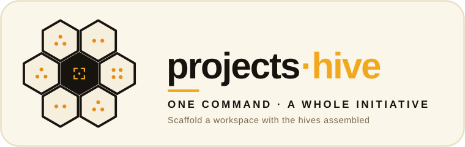

<p align="center">
  
</p>

# projects-hive

> **One command, a whole initiative.** Scaffolds a ready-to-work project
> workspace and assembles the House of Hives into it — skills, rules, tools, and
> agents, wired and ready.

*Part of the **[ai-hive](https://github.com/werkrbee/ai-hive)** family — werkrbee's House of Hives (skills · rules · tools · agents · and more).*

The **containers** layer of the House of Hives — *where it all comes together per
initiative*. A **scaffold** is a project template plus a manifest naming which
[plugins-hive](https://github.com/werkrbee/plugins-hive) pack to install. Running
it creates the project from the template, then fans the pack out to all four core
hives — so a new initiative starts fully equipped.

## Scaffolds

| Scaffold | What it stands up |
|----------|-------------------|
| [**werkrbee-initiative**](scaffolds/werkrbee-initiative/scaffold.json) | A working initiative wired to the `werkrbee-core` pack — Barry + Patricia, the Queen Bee's Charter, core tools, and the review fleet, plus a starter README and `docs/` |

A scaffold is a small `scaffold.json` plus a `template/` directory:

```json
{
  "name": "werkrbee-initiative",
  "pack": "werkrbee-core",
  "harnesses": ["claude-code", "cursor", "github-copilot"]
}
```

## Repository layout

```text
projects-hive/
├── scaffolds/
│   └── werkrbee-initiative/
│       ├── scaffold.json         # which pack to assemble
│       └── template/             # files copied into the new project ({{PROJECT_NAME}}, …)
├── scripts/
│   └── init.py                   # scaffold a project + invoke plugins-hive
├── LICENSE
└── README.md
```

Like plugins-hive, projects-hive has **no `adapters/` tree** — it composes rather
than holding harness-specific artifacts.

## Use

```bash
git clone https://github.com/werkrbee/projects-hive.git
cd projects-hive

# Preview
python3 scripts/init.py --name "Payments Revamp" --dry-run

# Create the initiative (default: ./payments-revamp)
python3 scripts/init.py --name "Payments Revamp"

# Somewhere specific, from a chosen scaffold
python3 scripts/init.py werkrbee-initiative --name "Q3 Migration" --dir ~/Projects/q3
```

`init.py`:

1. Copies the scaffold's `template/` into the new project, substituting
   `{{PROJECT_NAME}}`, `{{PROJECT_SLUG}}`, and `{{DESCRIPTION}}`.
2. Calls `plugins-hive` to install the pack — which installs **skills** globally
   and **rules + tools + agents** into the new project, for each harness.

The result: a project with `AGENTS.md`/`CLAUDE.md` (the charter), MCP configs, the
review agents, and Barry + Patricia available — ready to open in any harness.

## Getting the hives

projects-hive calls plugins-hive, which calls the four core hives. Easiest is the
[ai-hive](https://github.com/werkrbee/ai-hive) one-clone (submodules), or clone the
repos side by side and pass `--hives-dir` if they live elsewhere.

## Adding a scaffold

1. Create `scaffolds/<name>/scaffold.json` (`pack`, `harnesses`) and a `template/`.
2. Use `{{PROJECT_NAME}}` / `{{PROJECT_SLUG}}` / `{{DESCRIPTION}}` in template files.
3. Run `python3 scripts/init.py <name> --name "My Project"`.

## License

MIT — see [LICENSE](LICENSE).
